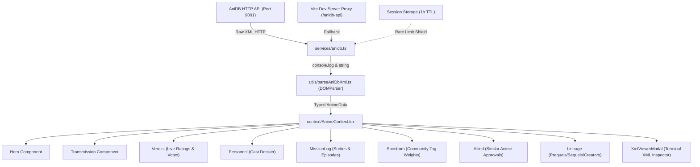

# Abh Imperial Archive — AniDB HTTP API Integration

A high-performance, cinematic web experience for anime archival data, featuring real-time XML ingestion from the **AniDB HTTP API** for record **AID 1** (*"Seikai no Monshou"* / *Crest of the Stars*).

---

## Table of Contents

- [Overview](#overview)
- [AniDB HTTP API Integration](#anidb-http-api-integration)
- [System Architecture](#system-architecture)
- [XML Schema & Data Mapping](#xml-schema--data-mapping)
- [Key Features](#key-features)
- [Getting Started](#getting-started)
- [Scripts & Commands](#scripts--commands)
- [CORS & Network Fallbacks](#cors--network-fallbacks)

---

## Overview

The **Abh Imperial Archive** transforms raw XML data retrieved from AniDB's HTTP API into an interactive, typography-focused editorial dossier. It blends dark sci-fi aesthetics with live community metrics (ratings, votes, episode guides, character dossiers, similar titles, and production lineage).

---

## AniDB HTTP API Integration

The application fetches real data directly using the AniDB HTTP API specification:

```typescript
const url = new URL("http://api.anidb.net:9001/httpapi");
url.searchParams.set("request", "anime");
url.searchParams.set("client", "silverloft");
url.searchParams.set("clientver", "1");
url.searchParams.set("protover", "1");
url.searchParams.set("aid", "1");

fetch(url)
  .then((res) => res.text())
  .then((xmlData) => console.log(xmlData));
```

### Request Parameters

| Parameter | Value | Purpose |
| :--- | :--- | :--- |
| `request` | `anime` | Requests detailed metadata for an anime record |
| `client` | `silverloft` | Registered client name for AniDB API |
| `clientver` | `1` | Client version identifier |
| `protover` | `1` | AniDB HTTP protocol version |
| `aid` | `1` | Anime ID (1 = *Seikai no Monshou*) |

---

## System Architecture



---

## XML Schema & Data Mapping

The parser in `src/utils/parseAniDbXml.ts` maps AniDB XML elements to reactive TypeScript structures:

### 1. Titles & Metadata (`<anime>`, `<titles>`, `<type>`, `<episodecount>`, `<dates>`)
- **Main Title**: Extracted from `<title xml:lang="x-jat" type="main">` (*Seikai no Monshou*).
- **Official English Title**: Extracted from `<title xml:lang="en" type="official">` (*Crest of the Stars*).
- **Japanese Title**: Extracted from `<title xml:lang="ja" type="official">` (*星界の紋章*).
- **Dates & Episodes**: Live start date, end date, episode count, and broadcast year.

### 2. Community Verdict (`<ratings>`)
- **Permanent Score**: `<permanent count="...">` (weighted score & total registered votes).
- **Temporary Score**: `<temporary count="...">` (current rolling score & total votes).
- **Review Score**: `<review count="...">` (mean of written reviews).

### 3. Personnel Dossier (`<characters>`)
- Extracted `<character id="..." type="...">` partitioned into **Main Cast** (`type="main character in"`), **Supporting Cast** (`type="secondary cast in"`), and **Holdings / Fleet** (non-human character types like *Gosroth*, *Wakusei Martine*, *Abh Teikoku*).
- Live observer votes and individual character ratings.

### 4. Mission Log (`<episodes>`)
- Filters `<episode>` where `<epno type="1">` (standard TV episodes).
- Extracts runtimes, air dates, multi-lingual titles (Japanese, English, Romaji), and per-episode community scores.

### 5. Spectrum Analysis (`<tags>`)
- Extracts `<tag weight="...">` and updates salience weights (0–600) for *Elements*, *Setting*, *Themes*, and *Craft*.

### 6. Allied Records & Lineage (`<similaranime>`, `<relatedanime>`, `<creators>`, `<resources>`)
- **Similar Anime**: Approval votes and total endorsement percentages.
- **Lineage**: Prequels (*Seikai no Danshou*), sequels (*Seikai no Senki*), and summaries.
- **Architects**: Director, Character Designer, Series Composition, and Music.
- **Resources**: Direct external links to Anime News Network (ANN), MyAnimeList (MAL), and Wikipedia.

---

## Key Features

- **Real-Time Data Ingestion**: Automatically calls the AniDB API on load and logs the complete raw XML payload to the console.
- **Raw XML Viewer Terminal**: Built-in modal accessible via the navigation header (`VIEW XML`) allowing inspection of the live transmission, single-click clipboard copying, and manual re-fetching.
- **Live Status Indicator**: Visual header badge signaling connection state (`LIVE DATA`, `FETCHING...`, or `STANDBY`).
- **Rate-Limiting Protection**: Automatic session storage caching prevents triggering AniDB's temporary IP bans during rapid page reloads.
- **Fluid Motion & Scroll**: Integrated with Lenis smooth scrolling and Framer Motion transitions.

---

## Getting Started

### Prerequisites

- Node.js (v18+ recommended)
- npm or yarn

### Installation

```bash
# Clone or navigate to the project directory
cd D:/parse-anime-xml-data

# Install dependencies
npm install
```

### Running the Development Server

```bash
npm run dev
```

Open [http://localhost:5173](http://localhost:5173) in your browser. The browser console will display the XML string fetched from the AniDB API.

### Production Build

```bash
npm run build
```

Generates a single self-contained production bundle in `dist/index.html`.

```bash
npm run preview
```

---

## CORS & Network Fallbacks

The AniDB HTTP API (`http://api.anidb.net:9001/httpapi`) emits `Access-Control-Allow-Origin: *`. However, for browser environments with non-standard port restrictions or mixed-content policies, the following fallback chain is in place:

1. **Direct Request**: Calls `http://api.anidb.net:9001/httpapi?...` directly.
2. **Vite Dev Server Proxy**: Falls back to `/anidb-api/httpapi?...` configured in `vite.config.ts`.
3. **Local Bundled XML**: Falls back to `/anidb_aid1.xml` if network connectivity is unavailable.
